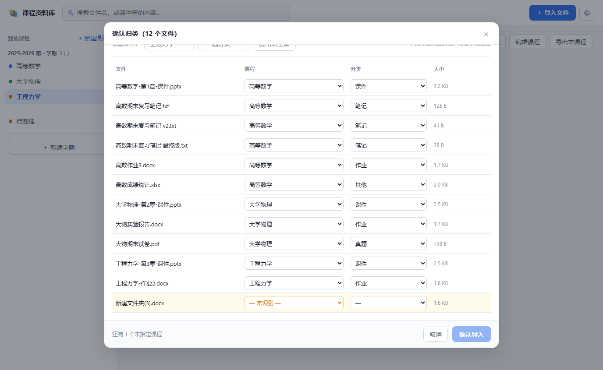
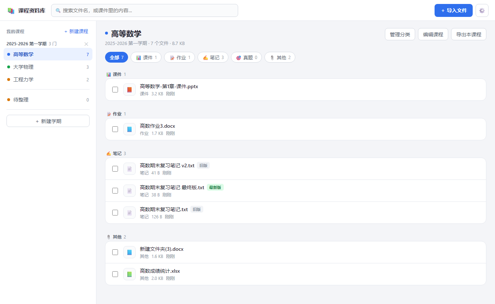
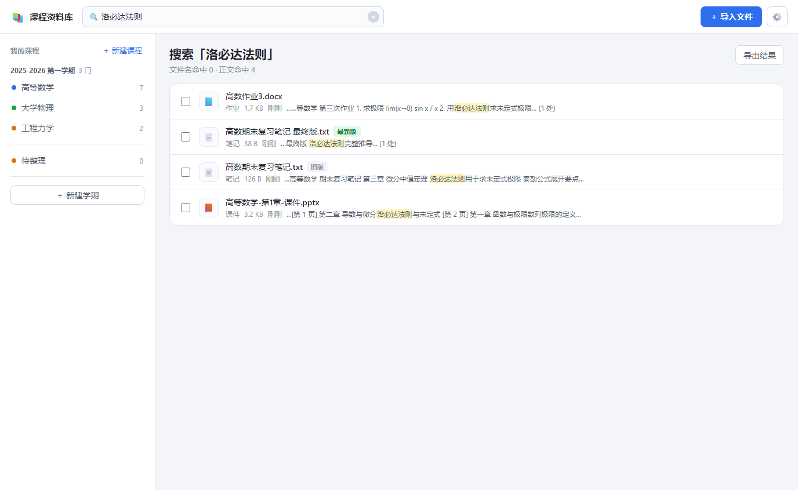

# 课程资料库

把散落各处的课件、作业、笔记、真题收进「**学期 → 课程 → 分类**」的结构里，能搜、能管版本、能一键打包。

**数据全部存在你自己的浏览器里。没有账号，没有服务器，不上传任何文件。**

在线使用：<https://fcyzjbn.github.io/course-library/>



上面这张是导入时最关键的一步：**文件还没有入库，先让你看一眼自动归类的结果。**
最后那行黄底的 `新建文件夹(3).docx` 是认不出归属的，它会一直拦着「确认导入」按钮，
直到你亲自指定——不硬猜，是刻意的。



三份同名笔记被认成同一组版本，`最终版` 标为最新版高亮，另外两份标为旧版。旧版不会被删。



搜的是**文件正文**，不只是文件名。第三行的 PPT 结果里能看到 `[第 1 页]`、`[第 2 页]` 标记，
页序是读 PPT 内部的页序定义得来的，不是按文件名排的。


---

## 为什么做这个

课程文件散在微信、QQ、网盘、U 盘、手机相册里，找一份「上学期的高数期末卷」要翻半天。
更烦的是同一份课件有 `v1`、`v2`、`最终版`、`最终版(2)`，永远不知道哪个是最后交的那份。

这个工具解决的就是这两件事：**收拢**和**认版本**。

它不做什么：不做云同步（那意味着要有服务器，也意味着你的文件要离开你的设备），
不做 AI 总结（那同样要求上传，而且工程类课件的公式在纯文本里会散架）。

---

## 快速开始

打开 <https://fcyzjbn.github.io/course-library/>，跟着空页面上的三步走：

1. **建学期** —— 例如「2025 秋」
2. **建课程** —— 填课程全称就行，常用简称（高数、大物、数构…）会自动补进别名
3. **导入文件** —— 拖进去，或者点「导入文件」

第一次导入时，软件会根据文件名猜每份文件属于哪门课、哪个分类，然后**先给你看一遍**：

> 这一步是刻意的。自动识别不可能 100% 准，与其吹「越用越准」，不如把把关的机会直接给你。
> **在点「确认导入」之前，任何文件都还没进库**，认错了当场改最省事。

**猜不出课程的文件不会被硬塞进某门课**，而是留在预览里标黄，等你手动指定。
一个都不许漏——预览里只要还有没指定课程的文件，「确认导入」按钮就是灰的。

---

## 怎么让它猜得更准

自动识别只看两样东西：**文件名**和**目录名**。

**最有效的办法是填别名。** 你的文件名里几乎不会写「高等数学」，只会写「高数」。
建课程时把常用的简称填进「别名」栏（用逗号分隔），识别率立刻不一样。

几个例子：

| 文件名 | 会归到 |
|---|---|
| `高数期末复习笔记.pdf` | 高等数学 · 笔记 |
| `大物实验报告.docx` | 大学物理 · 作业 |
| `工程力学-第3章-课件.pptx` | 工程力学 · 课件 |
| `2024期末试卷.pdf` | （认不出课程）→ 待整理 |

**选「整个文件夹」导入时，目录名也算线索。** 如果文件是这样放的：

```
高等数学/作业/第3次作业.docx
```

那么就算文件名里一个关键词都没有，也能靠目录名直接定出「高等数学 · 作业」。
所以从整理好的文件夹整体导入，比一个一个选文件准得多。

分类的推断是**加权打分**而不是「先匹配到哪个算哪个」。比如「期末复习笔记」同时命中
「期末」（指向真题）和「复习」「笔记」（指向笔记），打分后归到笔记——这符合直觉，
一份复习笔记不是考卷。

---

## 版本管理

同一门课、同一个分类下，文件名去掉版本标记后相同的文件，会被认成**同一份文件的不同版本**。

识别这些版本标记：`最新` `最终` `最终稿` `终版` `定稿` `定版` `final` `latest` `修订` `rev`
`v2` `第2版` `(2)` `副本` …

其中标了「最新 / 最终 / 定稿」的那份，或者版本号最大的那份，会被标成 **最新版** 高亮显示，
其余标 **旧版**。

**旧版本永远不会被自动删掉。** 只打标，不清理——万一标错了，你损失的是一份作业；
标错却删了，损失的就是交作业的机会。

---

## 搜索文件内容

除了搜文件名，还能搜**文件正文**。

导入之后，软件会在后台悄悄把 docx、pptx、xlsx、PDF、txt 的正文抽出来存进本地数据库
（这个过程不阻塞你继续操作），之后搜索框里打的字会连正文一起搜，命中处显示上下文片段。

**关于它的能力边界，有几句话要说在前面：**

- **扫描版 PDF 和图片搜不到。** 那是图片不是文字，本工具**不做 OCR**。这类文件会标上「无正文」，
  不是搜索漏了，是它本来就没有可搜的文本。
- **公式会丢。** 高数、工程力学的课件里那些积分号、矩阵，抽出来是残缺的。搜索不受影响
  （关键词在正文文字里），但别指望它能把公式还原出来。
- **PPT 的页序是对的。** 不是按文件名排，而是读 PPT 内部的页序定义——`第10章` 不会跑到 `第2章` 前面去。

---

## 备份（请认真看这一节）

**这是最重要的一节。**

数据存在浏览器的 IndexedDB 里。这带来两个后果，都是真的：

1. **清除浏览器数据会连资料一起清掉**，包括「清理垃圾文件」这类一键操作。
2. **换浏览器、换电脑，资料不会跟着走。** 数据不联网，本来也没法跟着走。

所以：

> ### 重要资料，导出一份备份放着。
>
> 设置页 → 「导出完整备份」，会打包一个 zip（原始文件 + 元数据）。
> 把它存到网盘或者移动硬盘上。想恢复时，同一个页面点「从备份恢复」选那个 zip 就行。

备份包里**不含**提取出的正文（那会让体积翻倍），恢复之后软件会重新提取一次，不用你管。

移动端和电脑之间搬资料，走的也是这个流程：**电脑上导出 zip → 传过去 → 手机上导入**。

---

## 装成 App 用

这是个 PWA，可以装到桌面或手机上，装完跟原生应用差不多，而且**装过一次之后离线也能用**
（数据本来就全在本地）。

- **电脑 Chrome / Edge**：地址栏右侧有个安装图标，点它
- **iPhone Safari**：分享 → 「添加到主屏幕」
- **Android Chrome**：菜单 → 「安装应用」

手机上主要是**查、看、导出**——导入和整理还是在电脑上顺手。

---

## 已知限制

- **不做云同步。** 多设备靠导出 zip 手动搬。
- **不做 OCR。** 扫描件、板书照片搜不到内容（但文件本身可以存进来）。
- **不做去重。** 同一份文件导入两次会出现两条记录，请手动删。
- **不支持自动读微信/QQ 的文件目录。** 浏览器没有权限读本机文件系统，而且微信的 `.dat`
  文件是加密的。老老实实用「选文件夹导入」。
- **建议总数据量控制在 2GB 以内。** 浏览器给网页的存储配额有限，超了会被拒绝写入。
- **PDF 提取是懒加载的。** 第一次导入 PDF 时会多下约 1.8MB（pdf.js 和它的中文映射表），
  之后就进缓存了。如果你从不导入 PDF，这部分永远不会下载。

---

## 本地运行 / 开发

没有构建步骤，没有依赖管理，克隆下来就能跑：

```bash
git clone https://github.com/FCYZJBN/course-library.git
cd course-library
node scripts/serve.js          # 然后打开 http://localhost:8000/
```

> 必须走 http，不能直接双击 `index.html`。`file://` 协议下浏览器的 Service Worker
> 和 ES Module 都会被拦掉。

### 测试

```bash
node scripts/test-classifier.mjs   # 分类引擎单元测试
node scripts/make-fixtures.mjs     # 生成冒烟测试用的假文件
node scripts/smoke.mjs             # 端到端冒烟测试（无头 Chrome 跑完整链路）
```

`smoke.mjs` 会自己起服务器和无头 Chrome，用 CDP 驱动真实浏览器走完
建学期 → 建课程 → 导入 → 归类 → 入库 → 提取 → 搜索 → 导出的全流程，
最后断开网络重载一次确认离线可用，并断言全程零未捕获异常。
它需要本机装有 Chrome，也可以用 `CHROME_PATH` 指定。

加 `BASE_URL` 可以让同一套断言直接打线上站点——部署完最该确认的是「线上真的能跑」，
而不是「文件能下载」：

```bash
BASE_URL=https://fcyzjbn.github.io/course-library/ node scripts/smoke.mjs
```

### 重新生成图标

```bash
node scripts/make-icons.mjs        # 手写 PNG 编码 + 4 倍超采样，不依赖任何图形库
```

### 目录结构

见 [DESIGN.md](DESIGN.md)。那里也有完整的设计决策记录、实现与原方案的偏差，
以及冒烟测试抓出来的 bug 清单。

---

## 技术

原生 JavaScript（ES Module），没有框架，没有构建步骤，没有 npm 依赖。
IndexedDB 存数据，JSZip 负责打包和解包，pdf.js 负责 PDF 文本提取（按需加载）。
一个 HTTP 静态服务器就能跑，GitHub Pages 免费托管。

---

## 许可

[MIT](LICENSE)。随便用，随便改，随便分享给同学。
